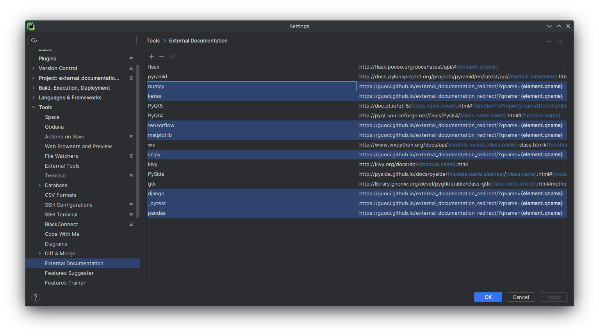

# Python external documentation redirect for JetBrains IDEs

This is the code for website to redirect to external documentation from the [`View external documentation`](https://www.jetbrains.com/help/pycharm/settings-tools-python-external-documentation.html) feature in Pycharm (or other Jetbrains IDEs with the Python plugin).

Pycharm hardly gives the correct URL for the documentation of 3rd party libraries. e.g. [PY-30970](https://youtrack.jetbrains.com/issue/PY-30970/Cannot-set-up-external-documentation-for-Django-2.0), [PY-36368](https://youtrack.jetbrains.com/issue/PY-36368/Bad-external-documentation-links-to-symbols-imported-directly-from-numpy-module), [PY-36306](https://youtrack.jetbrains.com/issue/PY-36306/Python-external-documentation-not-working-for-numpy), [PY-43736](https://youtrack.jetbrains.com/issue/PY-43736/Python-External-Documentation-Add-more-libraries-and-make-it-default-if-internal-is-missing)

Since most external documentation for 3rd party libraries do not follow a fixed pattern, it is impossible to use a template to give the correct URL for the documentation. This website uses a documentation mapping to redirect to the documentation URL.

## Usage

### Example configuration  

In `Settings` :arrow_right: `Tools` :arrow_right: `(Python) External Documentation`, change URLs for the supported modules to:

`https://guoci.github.io/external_documentation_redirect/?qname={element.qname}`

Press `Shift+F1` to get external documentation of the symbol under the cursor.

Currently supported modules:
- `django`
- `matplotlib`
- `numpy`
- `pandas`
- `pytest`

  add the URL pattern to `_pytest`
- `pytorch`
- `scipy`
- `tensorflow`, `tensorflow.keras`
  
  Requires adding `keras` and `tensorflow` URL pattern, see screenshot for an example.
  
  For `keras`, do import from `tensorflow.keras` instead of `keras`, for example:
  `import tensorflow.keras as keras`
  instead of 
  `import keras`
  

### Running a local instance
You can copy the files this repository and use [http.server](https://docs.python.org/3/library/http.server.html) to serve.
